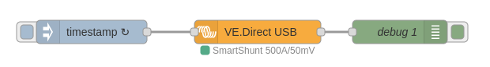

# node-red-contrib-victron-vedirect-usb

This node uses a [VE.Direct USB connection](https://www.victronenergy.com/accessories/ve-direct-to-usb-interface)
to grab the communication on the serial port and translates it into usable data.



A typical use case would be to run Node-RED on a Raspberry Pi and
connect to the VE.Direct port of a Victron Energy device. E.g. a
SmartShunt, BMV, Inverter or MPPT.

## Usage

Once the node gets deployed it keeps on reading and stores the values as they
get read from the serial port. It only outputs on 'inject', so it is needed to
trigger output via an _inject_ node to the node. Typically you would configure
that to repeat on an interval of a few seconds.

Note that, when using this from a GX device, it requires you to disable `serial-starter`
from using the VE.Direct usb cable. The way to accomplish this is described
[here](https://github.com/victronenergy/venus/wiki/howto-add-a-driver-to-Venus#howto-make-serial-starter-ignore-certain-usb-types).

## Configuration

Select the port to use from the dropdown. The dropdown is generated on the fly,
so make sure that the USB part of the cable is connected to the system running
Node-RED.

Note that there is a filter in place to first show cables that have the manufacturer
set to _Victron Energy BV_. This is there, because if the node tries to connect to
a non-functional port, it might crash Node-RED. This does not happen if it connects
to a functional port.

But if you know what you are doing you can also select a non-tested device.

## Output

The output depends on the connected product, but is based on the
[VE.Direct-Protocol-3.33.pdf](https://www.victronenergy.com/upload/documents/VE.Direct-Protocol-3.33.pdf).

The `msg.payload` holds the used VE.Direct label, the units, description and value. E.g.:

```
...
PID: {"value":"0xA389","description":"ProductID","units":"","product":"SmartShunt 500A/50mV"},
V: {"value":7814,"description":"Main or channel 1 (battery) voltage","units":"mV"},
I: {"value":0,"description":"Main or channel 1 battery current","units":"mA"}
...
```

The above example is abbreviated. It typically consists of more labels.

## Status

The node shows a green dot with the connected product when functional. It will
show a red dot with the error message when something went wrong.

## Development

### Project Structure

```
src/
├── lib/              # Pure functions and utilities (unit tested)
│   ├── checksum.js
│   ├── products.js
│   ├── field-definitions.js
│   └── value-parser.js
├── services/         # Business logic and stream handlers
│   ├── parser.js
│   └── vedirect.js
└── nodes/           # Node-RED node implementations
    └── vedirect-usb.js

test/
├── unit/            # Unit tests
│   ├── lib/
│   ├── services/
│   └── utils/
└── fixtures/        # Test data and fixtures
```

### Testing

This project uses Jest for unit testing.

```bash
# Run all tests
npm test

# Run tests in watch mode
npm run test:watch

# Run tests with coverage
npm run test:coverage
```

### Coverage

Test coverage reports are generated in the `coverage/` directory after running `npm run test:coverage`.

Target coverage goals:
- **lib/**: 100% (pure functions should be fully testable)
- **services/**: 80%+ (core business logic)
- **nodes/**: Not covered by unit tests (requires Node-RED runtime)

## License

License is _GPL-3.0-or-later_.

## About

The code is based on https://github.com/bencevans/ve.direct of Ben Evans.

Refactored for better maintainability with:
- Extracted pure functions for easy testing
- Comprehensive unit test coverage with Jest
- Modular architecture separating concerns
